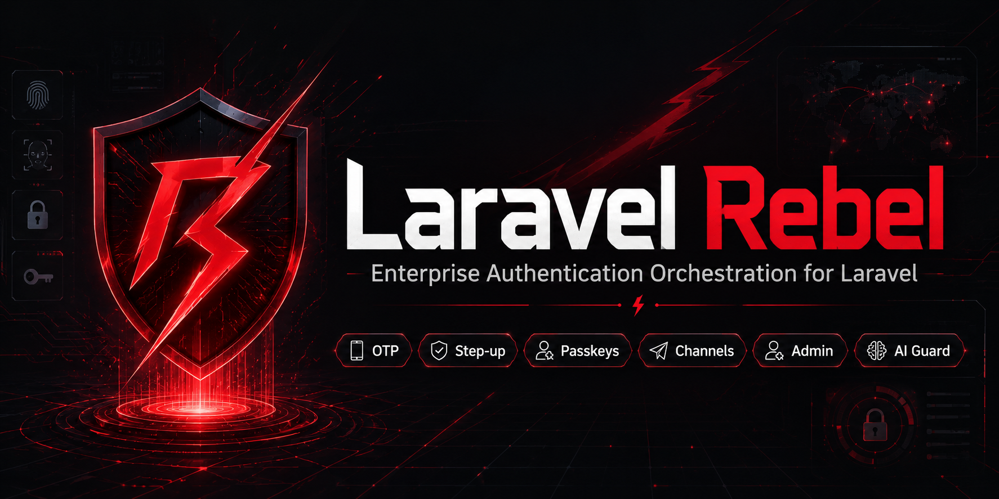

# Laravel Rebel — Sessions

> **Refresh-token rotation with reuse detection, logout-everywhere, and device trust.** When a stolen refresh token is replayed, Rebel detects the reuse and **burns the whole session — every token of that user** — instead of silently handing the attacker a fresh one. Plus remembered-device trust to cut step-up friction. Part of the `padosoft/laravel-rebel-*` suite.

<p align="center">
  
</p>

<p align="center">
  
  
  
  
  
  
</p>

---

## Table of contents

- [What it is](#what-it-is)
- [Quick glossary](#quick-glossary)
- [Why this package](#why-this-package)
- [Rebel Sessions vs the alternatives](#rebel-sessions-vs-the-alternatives)
- [How rotation + reuse detection works](#how-rotation--reuse-detection-works)
- [Installation](#installation)
- [Usage](#usage)
- [Security notes](#security-notes)
- [Testing & License](#testing--license)

---

## What it is

The device/session **registry** for Rebel. It provides the default implementations of two
core contracts — `SessionRegistry` (used by OTP/step-up for logout-everywhere and reuse
checks) and `DeviceTrust` (remembered devices) — plus a `SessionManager` that does the real
work: tracking sessions/refresh tokens and rotating them safely.

Depends on [`padosoft/laravel-rebel-core`](https://github.com/padosoft/laravel-rebel-core).

---

## Quick glossary

| Term | In plain words |
|---|---|
| **Refresh token** | A long-lived token exchanged for a fresh access token (e.g. on mobile). |
| **Rotation** | Each use of a refresh token **consumes** it and issues a brand-new one. |
| **Reuse detection** | If an already-used refresh token shows up again, it was probably stolen → react. |
| **Chain** | All the refresh tokens descended from one original login, sharing a `root_id`. |
| **Device trust** | "Remember this device" so it can skip step-up for a while. |

---

## Why this package

| ★ | What | In short |
|---|---|---|
| ★★★ | **Reuse detection that burns the chain** | A replayed refresh token doesn't just fail — it revokes **all** the user's tokens (the correct theft response). |
| ★★★ | **Ownership + expiry enforced** | A refresh token can only be rotated by its owner, and never after it expires. |
| ★★★ | **Race-safe rotation** | Every rotation locks the chain root, so concurrent requests serialize and no sibling escapes a burn. |
| ★★ | **Logout-everywhere** | One call revokes every active session/token of a subject. |
| ★★ | **Device trust** | Remembered devices (by fingerprint hash) expire after N days; atomic, tenant-scoped. |
| ★★ | **Drop-in contracts** | Implements the core `SessionRegistry` + `DeviceTrust` — OTP/step-up use them automatically. |

---

## Rebel Sessions vs the alternatives

| Capability | **Rebel Sessions** | Sanctum / Passport (native) | Hand-rolled |
|---|:---:|:---:|:---:|
| Refresh-token rotation | ✅ | ➖ (Passport rotates, Sanctum has no refresh) | ❌ |
| **Reuse detection** (theft signal) | ✅ | ❌ | ❌ |
| Burns the **whole chain/user** on reuse | ✅ | ❌ | ❌ |
| Owner + expiry enforced on rotate | ✅ | ➖ | ❌ |
| Race-safe (chain-root locking) | ✅ | ❌ | ❌ |
| Logout-everywhere | ✅ | ➖ | ➖ |
| Remembered-device trust | ✅ | ❌ | ❌ |
| Multi-tenant + audit-friendly | ✅ | ❌ | ❌ |

> Legend: ✅ built-in · ➖ partial · ❌ not available.

---

## How rotation + reuse detection works

```
login → issue refresh R0 (root of the chain)
   │
client exchanges R0 ──► rotateRefresh(R0): consume R0, issue R1 (parent=R0, root=R0)
   │
client exchanges R1 ──► consume R1, issue R2 ...
   │
ATTACKER replays a stolen R0 ──► rotateRefresh(R0):
        R0 is already 'consumed' ⇒ REUSE ⇒ burn EVERY live token of the user
        (sessions + the whole refresh chain) and return null
```

A rotation can only proceed if the token is **active**, **owned by the caller**, and **not
expired** — otherwise it returns null (and, for reuse, burns the user's tokens).

---

## Installation

```bash
composer require padosoft/laravel-rebel-sessions
php artisan vendor:publish --tag="rebel-sessions-migrations"
php artisan migrate
```

The package binds the core `SessionRegistry` and `DeviceTrust` contracts automatically.

---

## Usage

```php
use Padosoft\Rebel\Sessions\Enums\SessionType;
use Padosoft\Rebel\Sessions\SessionManager;

$sessions = app(SessionManager::class);

// On login: open a session and issue a refresh token
$session = $sessions->start($user, SessionType::Session, ttlSeconds: 3600);
$refresh = $sessions->start($user, SessionType::Refresh, ttlSeconds: 60 * 60 * 24 * 30);

// On token refresh: rotate (null = reject; a stolen-token replay burns the chain)
$next = $sessions->rotateRefresh($refresh->id, $user);
if ($next === null) {
    // token unknown / expired / reused → force a fresh login
}

// Logout everywhere
$sessions->revokeAll($user);
```

Device trust:

```php
use Padosoft\Rebel\Core\Context\DeviceContext;
use Padosoft\Rebel\Core\Contracts\DeviceTrust;

$trust = app(DeviceTrust::class);
$device = new DeviceContext(fingerprintHash: $hashOfThisDevice);

$trust->trust($user, $device, days: 30);   // "remember this device"
$trust->isTrusted($user, $device);          // true until it expires
$trust->untrust($user, $device);
```

---

## Security notes

- **Reuse = theft**: a replayed refresh token revokes every live token of the subject.
- **Ownership & expiry**: rotation checks the token belongs to the caller and isn't expired.
- **Race-safe**: rotations lock the chain root row, so concurrent rotations serialize.
- **UUID** ids; **tenant-scoped** queries; device fingerprints stored as hashes (never raw).

---

## Testing & License

```bash
composer test      # Pest (rotation, reuse-burn, ownership, expiry, logout-everywhere, device trust)
composer phpstan   # static analysis, level max
composer pint      # code style
```

**License:** MIT — see [LICENSE](LICENSE). Part of the [`padosoft/laravel-rebel`](https://github.com/padosoft) suite.
